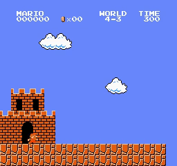
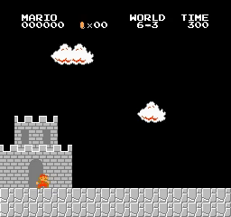
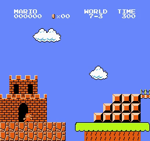
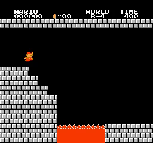

# Mario_NovelD
Playing Super Mario Bros using Proximal Policy Optimization with NovelD

## Introduction

My PyTorch Proximal Policy Optimization (PPO) and NovelD implement to playing Super Mario Bros. There are [PPO paper](https://arxiv.org/abs/1707.06347) and [NovelD paper](https://proceedings.neurips.cc/paper_files/paper/2021/file/d428d070622e0f4363fceae11f4a3576-Paper.pdf).

  
  
  
   
  
  
  
   
  
  
  
   
  
  
  
   
  
  
  
   
  
  
  
   
  
  
  
   
  
  
  
   
  <i>Results</i>

## Motivation

I'm experimenting with various RL algorithms (especially intrinsic reward) using Super Mario Bros. These algorithms are becoming increasingly complex, but their effectiveness isn't guaranteed due to a lack of testing or the absence of publicly available code. I found this paper (although it doesn't have code), but the idea is very simple and the experimental results are excellent. I reimplement it and ran it with Super Mario Bros to better understand the algorithm and evaluate its effectiveness.

## How to use it

You can use my notebook for training and testing agent very easy:
* **Train your model** by running all cell before session test
* **Test your trained model** by running all cell except agent.train(), just pass your model path to agent.load_model(model_path)

Or you can use **train.py** and **test.py** if you don't want to use notebook:
* **Train your model** by running **train.py**: For example training for stage 1-4: python train.py --world 1 --stage 4 --num_envs 8
* **Test your trained model** by running **test.py**: For example testing for stage 1-4: python test.py --world 1 --stage 4 --pretrained_model best_model.pth --num_envs 2

## Trained models

You can find trained model in folder [trained_model](trained_model)

## Hyperparameters

Below is a detailed hyperparameter table for full NovelD. This will work for all stages.

| Hyperparameters | Value |
| :--- | :--- |
| **num_envs** | 32 |
| **learn_step** | 512 |
| **batchsize** | 256 |
| **epoch** | 10 |
| **lambda** | 0.95 |
| **gamma** | 0.99 |
| **gamma_int** | 0.99 |
| **learning_rate** | 7e-5 |
| **target_kl** | 0.05 |
| **clip_param** | 0.2 |
| **max_grad_norm** | 0.5 |
| **update_proportion** | 0.25 |
| **norm_adv** | FALSE |
| **V_coef** | 0.5 |
| **entropy_coef** | 0.01 |
| **loss_type** | huber |
| **int_adv_coef** | 0.5 |
| **ext_adv_coef** | 1 |
| **norm_rnd_output** | True |

#### How to find it:
- `num_envs = 32`, the same as the NovelD paper and previous projects.
- `update_proportion = 0.25`, it just work (I don't need to tune this param)
- `int_adv_coef, ext_adv_coef: 0.5 and 1`, as in previous projects.
- `gamma, gamma_int: 0.99`, like previous projects.
- `entropy_coef = 0.01`: it just work (I don't need to tune this param)
- `learn_step = 512, batchsize = 256, lambda = 0.95, epoch = 10, lr = 7e-5, target_kl = 0.05, clip_param = 0.2, max_grad_norm = 0.5, norm_adv = false, V_coef = 0.5`, as in previous projects.
- `norm_rnd_output`: True, I will normalize rnd output by divide by running std because it will make intrinsic reward more stable. Some of my experiments suggest that non-normalization leads to poor or inefficient performance (insufficient experimental data to draw conclusions).
- `normalize intrinsic reward`: I didn't normalize intrinsic reward because the algorithm works fine without it (the paper doesn't mention it either). And I think that getting max(intrinsic reward, 0) * check_next_states requires the intrinsic reward to be 0 if intrinsic reward = False, so custom normalization would be needed if we want to normalize it.
- `SimplePixelHash`: The paper doesn't mention image hashing methods, only SimplePixelHash. I'm just using a simple method to hash images as shown in the code. Since this method works, I won't experiment further!

## Training step and training time

| World | Stage | training_step | training_time    |
|-------|-------|---------------|------------------|
| 1 | 1 | 114167 | 3:53:35 |
| 1 | 2 | 89084 | 3:00:10 |
| 1 | 3 | 117244 | 3:43:55 |
| 1 | 4 | 113147 | 4:00:07 |
| 2 | 1 | 337912 | 10:56:14 |
| 2 | 2 | 1772015 | 2 days, 15:26:25 |
| 2 | 3 | 177152 | 6:46:13 |
| 2 | 4 | 234494 | 8:01:23 |
| 3 | 1 | 523264 | 18:14:10 |
| 3 | 2 | 137206 | 4:53:58 |
| 3 | 3 | 240115 | 8:38:24 |
| 3 | 4 | 302072 | 10:51:24 |
| 4 | 1 | 61948 | 2:00:43 |
| 4 | 2 | 732154 | 1 day, 1:03:56 |
| 4 | 3 | 55806 | 2:01:17 |
| 4 | 4 | 171513 | 6:00:59 |
| 5 | 1 | 853501 | 1 day, 6:16:08 |
| 5 | 2 | 640000 | 1 day, 2:54:51 |
| 5 | 3 | 301050 | 9:22:36 |
| 5 | 4 | 166399 | 5:46:51 |
| 6 | 1 | 189432 | 6:45:38 |
| 6 | 2 | 294908 | 8:55:09 |
| 6 | 3 | 505838 | 15:16:59 |
| 6 | 4 | 759293 | 1 day, 2:36:57 |
| 7 | 1 | 240108 | 7:32:28 |
| 7 | 2 | 1520640 | 1 day, 21:10:41 |
| 7 | 3 | 1175541 | 1 day, 21:40:27 |
| 7 | 4 | 231424 | 6:59:39 |
| 8 | 1 | 1456106 | 1 day, 23:29:52 |
| 8 | 2 | 608246 | 19:05:51 |
| 8 | 3 | 755187 | 22:59:34 |
| 8 | 4 | 1223637 | 1 day, 16:27:55 |

## Discussion

* About Hyperparameters
    - I'm using this set of hyperparameters based on the ones I'm familiar with from previous projects. This isn't a standard or optimal set of hyperparameters. You can tune them.
    - Some hyperparameters are correlated; if you want to tune one hyperparameter, you need to check the others, for example: learning rate - batchsize, update_proportion - learning rate - batchsize - learn_step, gamma - gamma_int, ...

* About SimplePixelHash
    - I couldn't find any hashing methods in the paper or reference code. This is just one simple and working method. You should try a more suitable approach.
    - In theory, hashing is very important. However, experimental results show that for Super Mario Bros and some environments (in the paper), simple hashing still works:
        - Even with the same state, if the image displays time or score, it can be hashed into two keys! This will make the agent think it's a new state. A crucial component of the algorithm is counting whether the state in the episode is new or old.
        - Some newer papers, such as the paper [E3B](https://arxiv.org/pdf/2210.05805), mention the important role of hashing but it seems to have little or no effect on the Super Mario Bros. environment.
        - I tried removing the time and score. So when Mario doesn't move, it's treated as the old state. This didn't significantly improve the 8-4 state, so I skipped it (it's also quite a cheat)..
    - I haven't yet assessed the importance of SimplePixelHash, whether it can truly identify previously existing next_states or if it will simply hash many similar images into a single key!

* About reward normalization:
    - RND output:
        - Based on some experiments, I've found that normalizing the rnd output is necessary. Otherwise, rnd will become increasingly smaller, and the algorithm will become inefficient.
        - I just tried dividing by running standard and it worked. I didn't try min-max scaling as well.
    - intrinsic reward:
        - I didn't normalize because it works without normalization. I didn't try anything else.
        - Also, multiplying check_next_states needs to be 0 in the case of the old next_states. Although I didn't thoroughly test the role of hashing, my intuition tells me that custom normalization is needed if normalization is desired (keeping the value 0 when check_next_states = False). I didn't want to waste resources on testing because the algorithm already runs well without normalization!

## Requirements

* **python 3>3.6**
* **gym==0.25.2**
* **gym-super-mario-bros==7.4.0**
* **imageio**
* **imageio-ffmpeg**
* **cv2**
* **pytorch** 
* **numpy**

## Acknowledgements
With my code, I can completed all 32/32 stages of Super Mario Bros. 

## Reference
* [CVHvn PPO_RND](https://github.com/CVHvn/Mario_PPO_RND)
* [Stable-baseline3 PPO](https://stable-baselines3.readthedocs.io/en/master/_modules/stable_baselines3/ppo/ppo.html#PPO)
* [lazyprogrammer A2C](https://github.com/lazyprogrammer/machine_learning_examples/tree/master/rl3/a2c)
* [jcwleo RND](https://github.com/jcwleo/random-network-distillation-pytorch/blob/master/utils.py)
* [DI-engine RND](https://opendilab.github.io/DI-engine/12_policies/rnd.html)
* [vwxyzjn cleanrl/ppo_rnd_envpool.py](https://github.com/vwxyzjn/cleanrl/blob/master/cleanrl/ppo_rnd_envpool.py)

